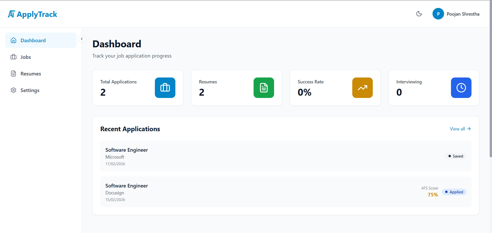
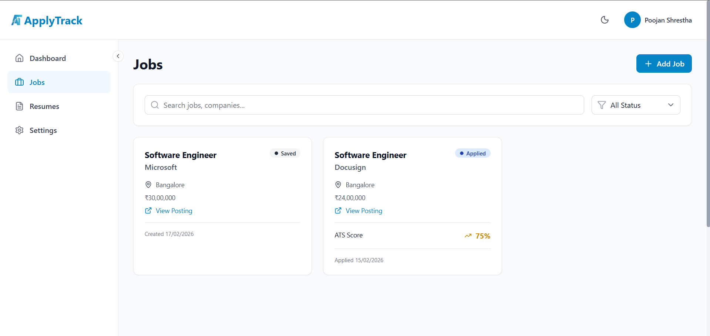
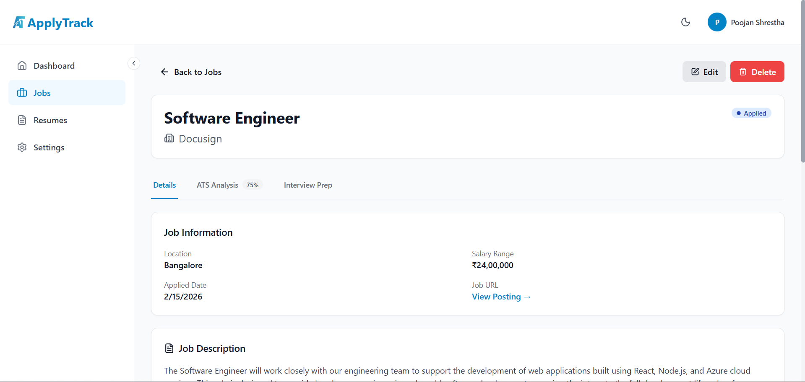
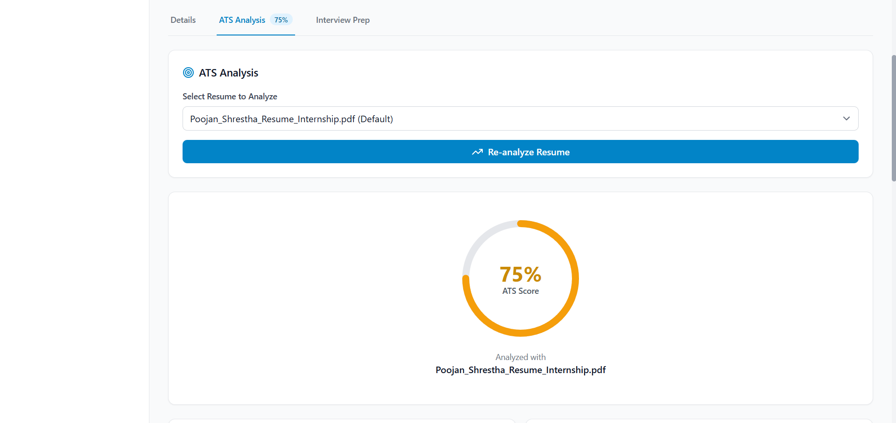
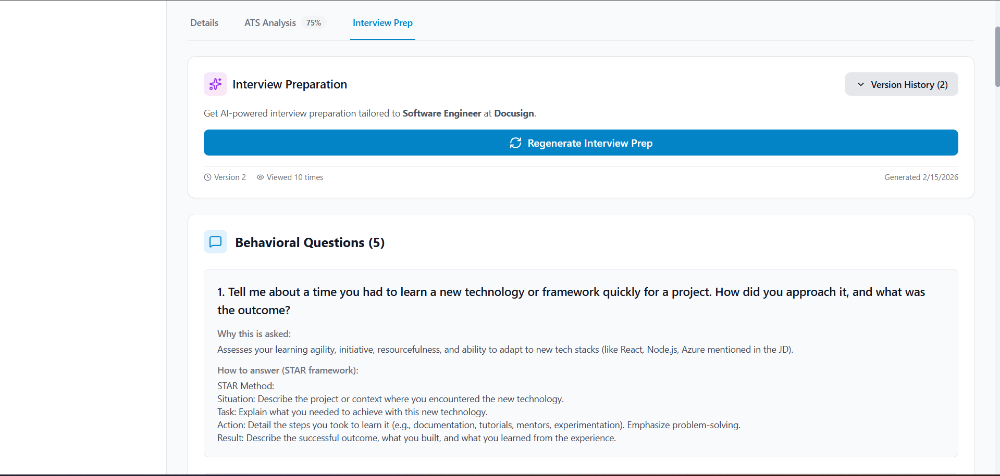
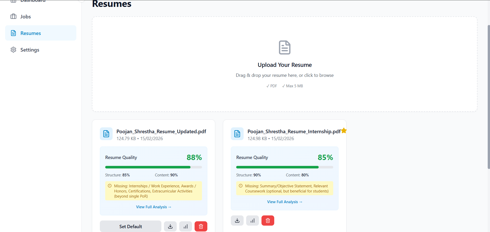

# 🚀 ApplyTrack - Job Application Tracker

> **Never lose track of your job applications again.** Track every application, optimize your resume, and prepare for interviews—all in one organized place.

👉 **Live Application:** [https://applytrack-silk.vercel.app](https://applytrack-silk.vercel.app)

---

## 🎯 The Problem

Job hunting is chaotic. Spreadsheets get messy. You forget where you applied. You don't know which resume version you sent. You're not sure if your resume even makes it past ATS filters.

**I built this because I faced these problems during my own job search.**

---

## ✨ The Solution

**ApplyTrack** is a job application tracker that helps you:
- 📊 Track every application in one organized place
- 🎯 Analyze how well your resume matches each job (ATS score)
- 📝 Get AI-powered resume quality feedback
- 💼 Generate personalized interview questions
- 📈 Monitor your application success rate
- ⚡ Stay organized and land jobs faster

---

## 🌟 Features

### 📊 **Smart Application Tracking**
- Track job applications with status updates (Saved, Applied, Interviewing, Offered, Rejected, Withdrawn)
- Add notes
- Search and filter applications
- Beautiful dashboard with analytics

### 🎯 **ATS Match Analysis**
- Upload your resume once
- Paste job descriptions for each application
- Get instant match score (0-100%)
- See missing keywords and skills
- Get actionable improvement suggestions

### 📝 **Resume Quality Analysis**
- AI analyzes resume structure and content
- Get quality score with detailed feedback
- Identify missing sections
- Receive specific improvement suggestions
- Support for multiple resume versions

### 💼 **AI Interview Prep**
- Generate personalized interview questions for each job
- Get company-specific insights
- Practice with role-based questions
- Save and review prep notes

### 📈 **Success Analytics**
- Track application success rate
- Monitor response times
- Visualize your job search pipeline
- Identify what's working

### 🎨 **Modern UI/UX**
- Clean, intuitive interface
- Dark mode support
- Fully responsive (mobile, tablet, desktop)
- Fast and smooth animations

### 🔒 **Security**
- Passwords hashed with bcrypt
- JWT tokens for authentication
- HTTP-only cookies 
- Input validation and sanitization
- CORS configured for frontend domain only
- Resume files stored securely in ImageKit

---

## 🛠️ Tech Stack

### **Frontend**
- **React** with TypeScript
- **Vite** - Lightning-fast build tool
- **TailwindCSS** - Utility-first styling
- **React Router** - Client-side routing
- **Lucide React** - Beautiful icons
- **React Hot Toast** - Notifications
- **Axios** - HTTP client

### **Backend**
- **Node.js** with Express
- **TypeScript** - Type safety
- **MongoDB** with Mongoose - Database
- **JWT** - Authentication
- **Bcrypt** - Password hashing
- **Google Gemini AI** - Resume & interview analysis
- **ImageKit** - Resume file storage

---

## 🎥 Demo

### **Screenshots**

#### Dashboard


#### Job Tracking


#### Job Details


#### ATS Analysis


#### Interviwe Prep


#### Resume Management


---

## 🚀 Installation

### **Prerequisites**
- Node.js 18+
- MongoDB
- Google Gemini API Key
- ImageKit Account (for resume uploads)

### **1. Clone the Repository**
```bash
git clone https://github.com/Poojan-Shrestha/ApplyTrack.git
cd ApplyTrack
```

### **2. Backend Setup**
```bash
cd backend
npm install

# Create .env file
cp .env.example .env

# Add your credentials to .env
PORT=5000
NODE_ENV=development
MONGODB_URI=your_mongodb_connection_string
JWT_SECRET=your_super_secret_jwt_key
JWT_EXPIRE=7d
GEMINI_API_KEY=your_gemini_api_key
IMAGEKIT_PUBLIC_KEY=your_imagekit_public_key
IMAGEKIT_PRIVATE_KEY=your_imagekit_private_key
IMAGEKIT_URL_ENDPOINT=your_imagekit_url
FRONTEND_URL=http://localhost:5173

# Start backend
npm run dev
```

### **3. Frontend Setup**
```bash
cd frontend
npm install

# Create .env file
cp .env.example .env

# Add API URL
VITE_API_URL=http://localhost:5000/api
VITE_IMAGEKIT_PUBLIC_KEY=your_imagekit_public_key
VITE_IMAGEKIT_URL_ENDPOINT=your_imagekit_url

# Start frontend
npm run dev
```

### **4. Open Application**
Visit `http://localhost:5173` in your browser

---

## 🤝 Contributing

Contributions are welcome!

### **Development Workflow**
1. Fork the repository
2. Create feature branch (`git checkout -b feature/amazing-feature`)
3. Commit changes (`git commit -m 'Add amazing feature'`)
4. Push to branch (`git push origin feature/amazing-feature`)
5. Open Pull Request

---

## 👨‍💻 Author

**Poojan Shrestha**
- GitHub: [Poojan-Shrestha](https://github.com/Poojan-Shrestha)
- Email: poojanshrestha102@gmail.com

---

## 💡 Inspiration

Built out of personal frustration with messy job application spreadsheets. If you're struggling with your job hunt, I hope this helps! 

**Free forever. Built for job seekers.**

---

## ⭐ Show Your Support

If this project helped you, please give it a ⭐️!

---

**Made with ❤️ and ☕ by a developer who knows the struggle.**